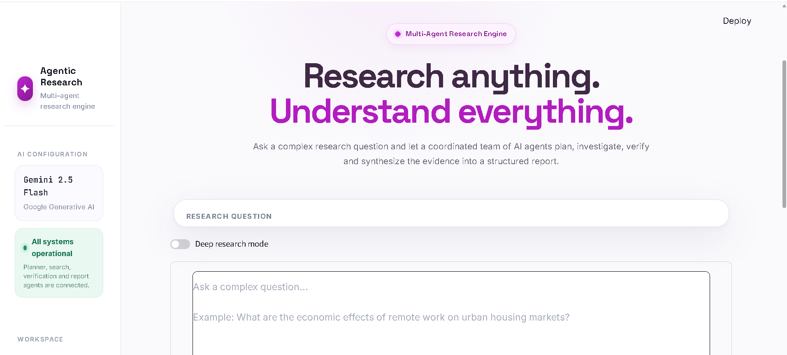
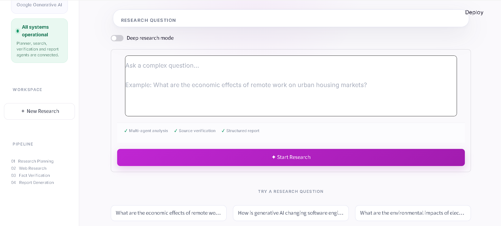
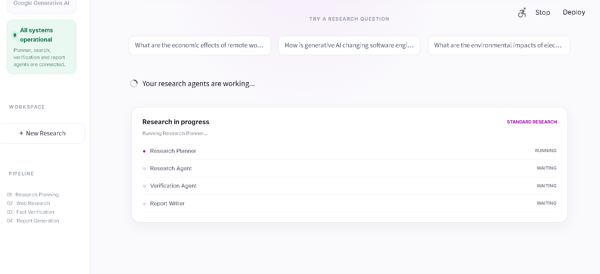
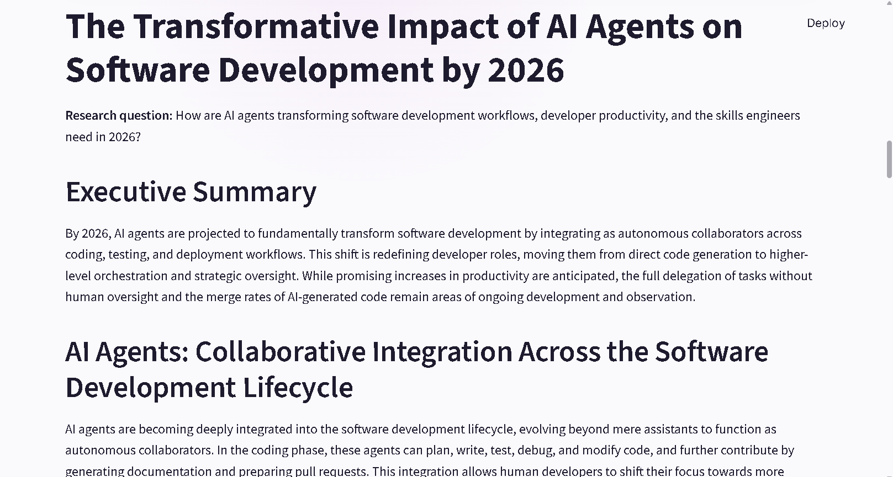

# Agentic AI Research Assistant

An agentic AI research assistant that performs structured web research using a multi-stage pipeline of **planning, evidence gathering, verification, and report generation**.

The system is built with **Google Gemini, Google Search grounding, LangGraph, and Streamlit** to transform a research question into a structured, evidence-backed report.

## ✨ Key Features

* 🤖 **Agentic Research Pipeline**

  * Planner
  * Search / Research
  * Verification
  * Report Writer

* 🔎 **Web-Grounded Research**

  * Uses Gemini with Google Search grounding to collect current web evidence.
  * Collects and deduplicates source references.

* 🧠 **Normal Research Mode**

  * Performs one research pass for each generated research sub-question.

* 🔬 **Deep Research Mode**

  * Performs multiple independent research passes for each sub-question.
  * Combines and deduplicates the resulting evidence.

* ✅ **Evidence Verification**

  * Evaluates research findings against collected sources.
  * Produces a verification verdict and confidence level.
  * Identifies potentially unsupported or insufficiently corroborated claims.

* 📊 **Research Quality Metrics**

  * Number of research tasks
  * Findings
  * Evidence sources
  * Verification records

* 📝 **Structured Final Reports**

  * Executive summary
  * Research findings
  * Evidence and sources
  * Verification information

* 📄 **Report Export**

  * Markdown report
  * PDF report

* 💾 **Research History**

  * Stores completed research sessions locally for later review.

* 🛡️ **Input Validation**

  * Rejects empty or low-information queries before unnecessary research API calls.

* ⚡ **Progress Feedback**

  * Displays the research pipeline stages while the agents are working.

---

## 🏗️ Architecture

The application follows a multi-agent research workflow:

```text
                    User Research Question
                              │
                              ▼
                       ┌─────────────┐
                       │   Planner   │
                       └──────┬──────┘
                              │
                     Research Sub-Questions
                              │
                              ▼
                       ┌─────────────┐
                       │   Search    │
                       │   Agent     │
                       └──────┬──────┘
                              │
                     Evidence + Sources
                              │
                              ▼
                       ┌─────────────┐
                       │ Verification│
                       │    Agent    │
                       └──────┬──────┘
                              │
                    Verified Research Findings
                              │
                              ▼
                       ┌─────────────┐
                       │   Report    │
                       │   Writer    │
                       └──────┬──────┘
                              │
                              ▼
                       Final Research Report
```

The workflow is orchestrated using **LangGraph**.

---
## 📸 Screenshots

### Main Interface



### Research Pipeline



### Verification & Quality



### Final Research Report



---
## 🔬 Normal vs Deep Research

### Normal Research

Normal mode performs a single research pass for each generated sub-question.

```text
Research Question
       ↓
Planner
       ↓
Sub-question
       ↓
Research
       ↓
Verification
       ↓
Final Report
```

### Deep Research

Deep Research performs multiple independent research passes for each sub-question and combines the resulting evidence.

```text
Research Question
       ↓
Planner
       ↓
Sub-question
       ↓
   ┌───────────────┐
   │               │
Research Pass 1  Research Pass 2
   │               │
   └───────┬───────┘
           ↓
     Combine Evidence
           ↓
      Deduplicate
           ↓
      Verification
           ↓
      Final Report
```

This provides broader evidence collection for research questions where additional coverage is useful.

---

## 🧠 Research Pipeline

### 1. Planner Agent

The Planner analyzes the user's research question and generates focused sub-questions and research topics.

### 2. Search / Research Agent

The Search Agent researches each sub-question using Gemini with Google Search grounding.

It collects:

* Research findings
* Supporting evidence
* Source URLs
* Source metadata

Sources are subsequently deduplicated before being presented in the application.

### 3. Verification Agent

The Verification Agent evaluates the generated findings and produces structured verification information such as:

* Verdict
* Confidence
* Flagged claims
* Source relevance notes
* Agreement notes

This helps distinguish well-supported findings from claims that require additional evidence.

### 4. Report Writer Agent

The Report Writer converts the verified research into a structured final report containing the main conclusions, evidence, and source information.

---

## 🛠️ Tech Stack

| Technology              | Purpose                         |
| ----------------------- | ------------------------------- |
| Python                  | Core programming language       |
| Streamlit               | Interactive web interface       |
| Google Gemini           | AI reasoning and generation     |
| Google Search Grounding | Web-based evidence retrieval    |
| LangGraph               | Agent workflow orchestration    |
| python-dotenv           | Environment variable management |
| FPDF                    | PDF report generation           |
| SQLite                  | Local research history storage  |
| Git / GitHub            | Version control                 |

---

## 📁 Project Structure

```text
Agentic AI Research Assistant/
│
├── agents/
│   ├── __init__.py
│   ├── planner.py
│   ├── searcher.py
│   ├── verifier.py
│   ├── report_writer.py
│   ├── utils.py
│   │
│   ├── planner.png.png
│   ├── research.png.png
│   ├── verification.png.png
│   └── report.png.png
│
├── app.py
├── graph.py
├── history.py
├── state.py
│
├── test_graph.py
├── test_graph_full.py
├── test_graph_nodes.py
├── test_history.py
├── test_planner.py
├── test_report_writer.py
├── test_searcher.py
├── test_state.py
└── test_verifier.py
```

### Main Components

**`app.py`**

Streamlit application and user interface.

**`graph.py`**

Defines and executes the LangGraph research workflow.

**`state.py`**

Defines the shared research state used throughout the agent pipeline.

**`history.py`**

Handles local research-history storage and retrieval.

**`agents/planner.py`**

Generates research sub-questions.

**`agents/searcher.py`**

Performs web-grounded research and source collection.

**`agents/verifier.py`**

Verifies research findings and evaluates evidence.

**`agents/report_writer.py`**

Generates the final structured research report.

---

## 🚀 Installation

### 1. Clone the repository

```bash
git clone https://github.com/Tejasgahire/agentic-ai-research-assistant.git
cd agentic-ai-research-assistant
```

### 2. Create a virtual environment

```bash
python -m venv venv
```

Activate it on Windows:

```bash
venv\Scripts\activate
```

### 3. Install dependencies

Install the required Python packages:

```bash
pip install streamlit google-genai python-dotenv langgraph fpdf2
```

### 4. Configure the Gemini API key

Create a `.env` file in the project root:

```env
GEMINI_API_KEY=your_api_key_here
```

The API key is loaded through environment variables and is intentionally excluded from version control.

---

## ▶️ Run the Application

Start the Streamlit application:

```bash
streamlit run app.py
```

Streamlit will provide a local URL similar to:

```text
http://localhost:8501
```

Open the URL in your browser.

---

## 🔐 Environment & Security

The project uses environment variables for API credentials.

Sensitive files such as:

```text
.env
.env.*
```

are excluded through `.gitignore`.

Local development files such as the virtual environment, Python cache, logs, and local database are also excluded from version control.

**Never commit API keys or other credentials to GitHub.**

---

## 🧪 Testing

The project includes tests for the main components of the research system.

Examples include:

```text
test_planner.py
test_searcher.py
test_verifier.py
test_report_writer.py
test_state.py
test_history.py
test_graph.py
test_graph_nodes.py
test_graph_full.py
```

The tests cover individual agents, state handling, history functionality, graph execution, and the overall research workflow.

---

## 💡 Example Research Questions

The assistant can be used for questions such as:

```text
How is generative AI changing software engineering jobs and required skills in 2026?
```

or:

```text
How are AI agents changing software engineering in 2026, including developer productivity, coding automation, security risks, and required engineering skills?
```

The system plans the research, gathers evidence, verifies findings, and generates the final report.

---

## 📊 Research Output

A completed research session provides:

* Research tasks
* Findings
* Evidence sources
* Verification results
* Confidence information
* Flagged claims
* Final report
* Source references

Reports can also be exported for further use.

---

## 🎯 Project Goals

This project demonstrates the practical implementation of an **agentic AI research workflow** rather than a simple single-prompt chatbot.

The main goals are:

* Structured multi-agent reasoning
* Web-grounded information retrieval
* Evidence collection
* Source deduplication
* Claim verification
* Automated report generation
* Research history management
* Interactive research workflows

---

## 🔮 Future Enhancements

Potential future improvements include:

* More advanced source-quality scoring
* Citation-aware report generation
* Additional search providers
* Parallel research execution
* Improved claim-level verification
* Research comparison across multiple runs
* User authentication
* Cloud database support
* Deployment to a cloud platform
* More configurable research depth

---

## 👨‍💻 Author

**Tejas Gahire**

MCA — Maharashtra Institute of Technology, Chhatrapati Sambhajinagar

Interested in:

* Artificial Intelligence
* Machine Learning
* Generative AI
* Data Analytics
* Agentic AI Systems

---

## ⭐ Project Highlights

**Planner → Search → Verify → Report**

A complete agentic research pipeline combining **Gemini, Google Search grounding, LangGraph, and Streamlit** to produce structured, evidence-backed research reports.
